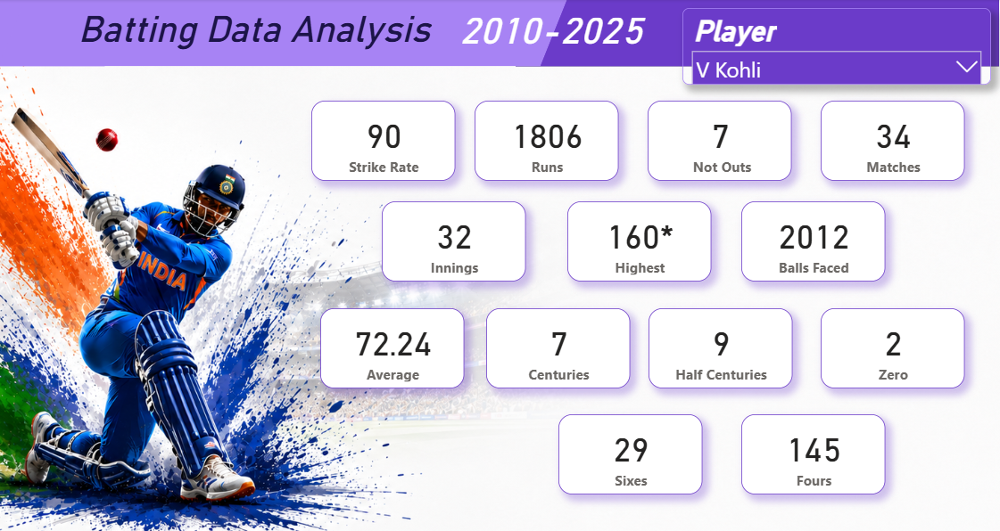

# 🏏 Indian Cricket Team Player Performance Analysis | Power BI

## 📌 Project Overview

This Power BI dashboard presents a player-wise performance analysis of the Indian Cricket Team. The report enables users to evaluate the performance of individual players across three major aspects of the game: **Batting**, **Bowling**, and **Fielding**.

The dashboard consists of **three dedicated report pages**, each focusing on a specific area of performance. Users can select any player using the interactive player slicer, and all performance statistics on the selected page update dynamically.

The report has been designed with a clean and visually appealing layout by incorporating custom shapes and a themed background image, providing an intuitive and engaging user experience.

---

## 🎯 Project Objectives

* Analyze individual player performance in batting, bowling, and fielding.
* Provide an easy way to explore player statistics using interactive filtering.
* Present key performance indicators in a simple and user-friendly dashboard.
* Create a visually appealing report with a clean and consistent design.

---

## 📄 Report Pages

### 🏏 Batting Analysis

Displays batting-related performance metrics for the selected player using KPI cards.

  

### 🎯 Bowling Analysis

Displays bowling performance statistics for the selected player using KPI cards.

  

### 🧤 Fielding Analysis

Displays fielding statistics for the selected player using KPI cards.

  

---

## 🎛 Interactive Features

* Player Name Slicer
* Dynamic KPI Cards
* Interactive Cross-Filtering
* Consistent Navigation Across Pages

---

## 🎨 Dashboard Design

The report focuses on simplicity and readability by using:

* Custom shapes for structured layouts
* Background canvas images for an enhanced visual appearance
* Consistent color theme across all report pages
* Minimalistic card-based dashboard design

---

## 📂 Dataset

The dataset contains performance statistics of Indian cricket players, including batting, bowling, and fielding records.

Example fields include:

* Player Name
* Matches Played
* Runs Scored
* Batting Average
* Strike Rate
* Wickets
* Bowling Average
* Economy Rate
* Catches
* Run Outs
* Stumpings

---

## 🛠 Tools & Technologies Used

* Microsoft Power BI Desktop
* Power Query
* DAX
* Data Modeling

---

## 📈 Power BI Features Used

* Card Visuals
* Slicer
* DAX Measures
* Power Query
* Data Modeling
* Custom Shapes
* Canvas Background Images

---

## 💡 Key Features

* Player-wise performance analysis
* Three dedicated report pages
* Interactive player selection
* Clean and visually appealing dashboard design
* Consistent user experience across all report pages

---

## 🚀 Skills Demonstrated

* Power BI Dashboard Development
* Data Modeling
* Power Query
* Report Design
* Interactive Dashboard Design
* Data Visualization

